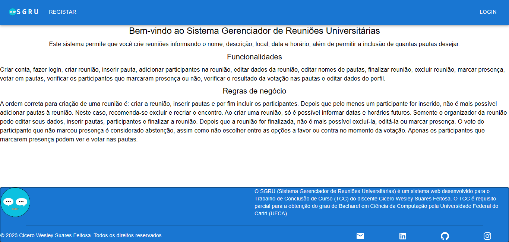

# SGRU
Sistema Gerenciador de Reuniões Universitárias




> O SGRU é um sistema que permite gerenciar reuniões, possuindo o cadastro delas, de pautas e participantes e também a funcionalide de votar em pautas. Ele foi o meu TCC no curso de Cicência da Computação da UFCA.

## 💻 Pré-requisitos

Antes de começar, verifique se você atendeu aos seguintes requisitos:
* Você instalou a versão mais recente do `Docker`?

## 🚀 Instalando SGRU

Para instalar o SGRU, siga esta etapa:

Linux:
```
sudo docker compose build
```

## ☕ Usando SGRU

Para usar SGRU, siga esta etapa:

```
sudo docker compose up
Acessar o endereço da aplicação via navegador.
```

## 📝 Licença

Esse projeto está sob licença. Veja o arquivo [LICENÇA](LICENSE) para mais detalhes.

[⬆ Voltar ao topo](#sgru)<br>
